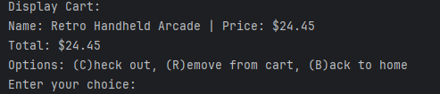
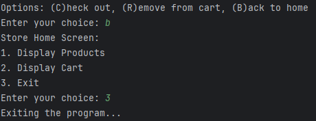

# Workshop Three - Online Store
### Contributions for this project were done by Brian Stith and Jason Moo

## Application Home Screen
Here is the opening screen for the store from which you can access the 3 option we implemented:

## Overview of the options on Home
When a user chooses one of the corresponding here are examples of what they see:

**
 Display Products 
**
When a user chooses option 1 they are shown the following prompt:
Which allows them to either search for a particular item based on 3 distinct
ways or press enter to
display all available items.

For demonstration purpose we can assume the user presses enter, upon pressing
enter they are met with the following display. All available products are listed
and the user has the 2 options (A)dd or (B)ack.

If a user chooses to (A)dd a product to their cart is done by entering the SKU.
As an example in the following image a user added the Retro Handheld Arcade (GM1148).

**
 Display Cart 
**
When a user adds an item to the cart the items added display as in the
format of Name | Price for each item, followed by the total price displayed
as Total. Users from this screen also have the option to (C)heck out,
(R)emove from cart, (B)ack to home.

**
 Exit 
**
At any point the user can navigate back to the home screen and exit the application
regardless of the status of items in their cart.

## Error Handling
Both primary sections of the application, **Display** **Product** and **Display** **Cart**
have feature to handle invalid choices. Should a user input something not wanted they will
be met with an invalid choice prompt

## Interesting Piece of Code

The following pieces of code demonstrate adding a **Store** and **Cart** class as well as
using them as constructors.

